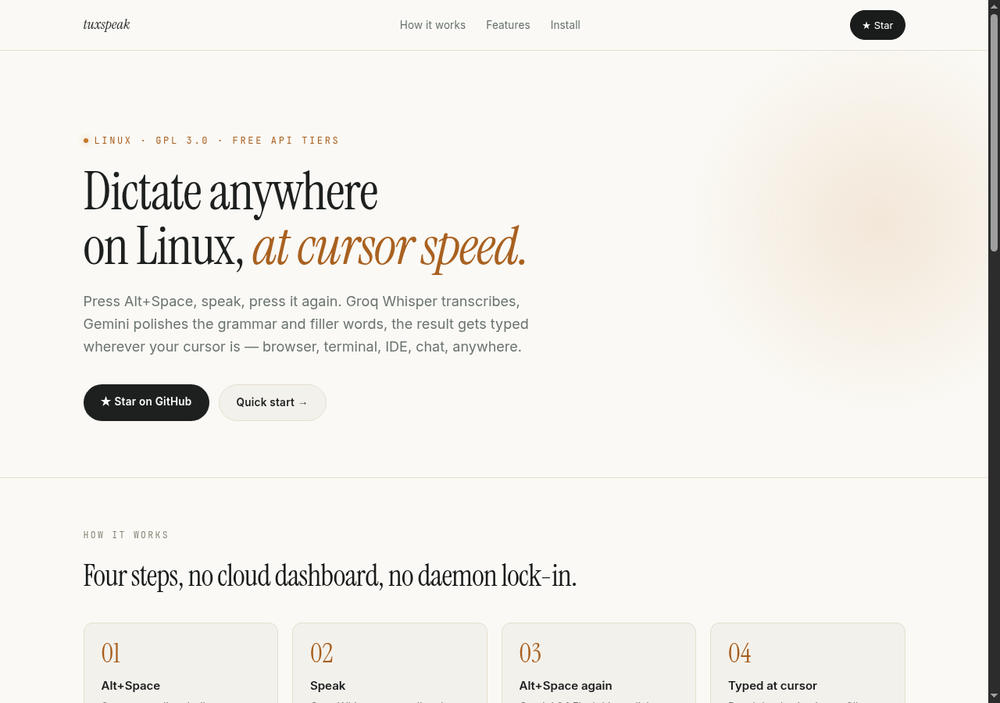

# TuxSpeak


**Dictate anywhere on Linux. Press Alt+Space, speak, get AI-polished text typed at your cursor.**

[](https://tuxspeak.barestack.org)
[](https://github.com/anirudhprashant/tuxspeak)

Record speech → Groq Whisper transcribes → Gemini polishes the text → typed wherever your cursor is. Works in any app: browser, terminal, IDE, chat, email, anywhere you can type.

Built on [xhisper](https://github.com/imaginalnika/xhisper) (MIT), extended with AI polishing, history, and a GUI browser.



---

## Quick Start

```bash
git clone https://github.com/anirudhprashant/tuxspeak.git
cd tuxspeak
./install-xhisper.sh
```

The installer handles dependencies, API key setup, build, and shortcut configuration.

---

## How It Works

| Step | Action | Result |
|------|--------|--------|
| **1** | Press `Alt+Space` | Starts recording |
| **2** | Speak | Groq Whisper transcribes in real time |
| **3** | Press `Alt+Space` again | Gemini polishes the text |
| **4** | Text appears | Typed at your cursor via uinput |

- **First press**: starts recording (indicator shows `(recording...)`)
- **Second press**: stops, transcribes, polishes, types the result
- **Silence detection**: if no sound detected, cancels without pasting
- **History**: every dictation saved with timestamp, raw + polished versions

---

## Features

- **Cross-app dictation** — works in browser, terminal, IDE, chat, email, and any text field
- **AI polishing** — Gemini 3.1 Flash Lite cleans up filler words and grammar
- **Dictation history** — review and re-copy past transcriptions
- **Local-first** — audio stays on your machine; only audio blobs are sent to APIs
- **Open source** — GPL 3.0 for the wrapper, MIT for the xhisper core
- **Free APIs** — Groq Whisper and Gemini both have generous free tiers

---

## Requirements

- Linux with PipeWire (for audio recording)
- A keyboard (for the Alt+Space shortcut)

### Free API Keys

| Service | What It Does | Get Key |
|---------|-------------|---------|
| **Groq** | Speech-to-text (Whisper) | [console.groq.com/keys](https://console.groq.com/keys) |
| **Gemini** | Text polishing (Gemini 3.1 Flash Lite) | [aistudio.google.com/apikey](https://aistudio.google.com/apikey) |

Both have generous free tiers. No credit card needed.

---

## Install

### Option 1: AI agent install

Copy this block into Claude Code, ChatGPT, or any AI coding agent:

```
I want to install TuxSpeak on my Linux machine. Here's what to do:

1. Clone https://github.com/anirudhprashant/tuxspeak.git
2. Read the README.md first to understand the project
3. Run ./install-xhisper.sh — it will prompt me for my Groq and Gemini API keys
   - Groq free key: https://console.groq.com/keys
   - Gemini free key: https://aistudio.google.com/apikey
4. After install, set up the Alt+Space keyboard shortcut:
   - GNOME: free the Alt+Space binding first with:
     gsettings set org.gnome.desktop.wm.keybindings activate-window-menu "[]"
   - Then create a custom shortcut: Name=TuxSpeak, Command=xhisper-gemini, Shortcut=Alt+Space
   - For other desktop environments/WMs (KDE, i3, Sway, Hyprland), bind Alt+Space to xhisper-gemini using that environment's shortcut config
5. Start the daemon: nohup xhispertoold &>/dev/null &
6. Tell me to reboot if I was added to the input group
7. Verify it works — tell me to press Alt+Space and speak
```

### Option 2: Manual install

```bash
git clone https://github.com/anirudhprashant/tuxspeak.git
cd tuxspeak
./install-xhisper.sh
```

The installer:
1. Installs system dependencies (`curl`, `jq`, `ffmpeg`, `gcc`, `make`, `yad`, `xdotool`, `xclip`, `wl-clipboard`, `pipewire`)
2. Prompts for your Groq and Gemini API keys (saved to `~/.env`)
3. Builds and installs the xhisper C tools (`xhispertool`, `xhispertoold`)
4. Copies scripts to `~/.local/bin/`
5. Sets up udev rules for uinput (virtual keyboard)
6. Adds you to the `input` group

**Reboot after install** if you were added to the `input` group.

---

## Set Up Keyboard Shortcut

After install, bind the shortcut:

**GNOME:**
```
Settings → Keyboard → View and Customize Shortcuts → Custom Shortcuts → +
  Name: TuxSpeak
  Command: /home/YOUR_USER/.local/bin/xhisper-gemini
  Shortcut: Alt+Space
```

First free Alt+Space if GNOME uses it for window menu:
```bash
gsettings set org.gnome.desktop.wm.keybindings activate-window-menu "[]"
```

**KDE:**
```
System Settings → Shortcuts → Custom Shortcuts → Edit → New → Global Shortcut → Command/URL
  Trigger: Alt+Space
  Action: /home/YOUR_USER/.local/bin/xhisper-gemini
```

**Other WMs** (i3, Sway, Hyprland, etc.): bind `xhisper-gemini` to Alt+Space in your config.

---

## Usage

### Dictate (Alt+Space)

Press **Alt+Space** to start recording. Speak. Press **Alt+Space** again to stop and get polished text.

The polished text is typed at your cursor. Raw and polished versions saved to history.

### GUI Popup (`xhisper-gui`)

Shows last dictation with two buttons:
- **Copy** — copies last dictation to clipboard
- **History** — opens scrollable history viewer

> **Note:** GUI coordinates are hardcoded for 1920×1080 (bottom-right, above dock). If your screen resolution differs, edit `~/.local/bin/xhisper-gui` and change `X_POS` and `Y_POS`.

### Terminal Commands

| Command | What It Does |
|---------|-------------|
| `xhisper-gemini` | Record → transcribe → polish → type (same as Alt+Space) |
| `xhisper-gui` | GUI popup with last dictation + history |
| `xhisper-last` | Print last polished dictation to terminal |
| `xhisper-history` | Print full history to terminal |

---

## Files

| Path | What |
|------|------|
| `~/.local/bin/xhisper-gemini` | Main dictation script |
| `~/.local/bin/xhisper-gui` | GUI popup |
| `~/.local/bin/xhisper-last` | Last dictation viewer |
| `~/.local/bin/xhisper-history` | History viewer |
| `~/.local/share/xhisper/history.txt` | Dictation history (timestamped, raw + polished) |
| `~/.config/xhisper/xhisperrc` | Optional config (thresholds, timing) |
| `~/.env` | API keys (Groq + Gemini) |

---

## Configuration

Copy the default config and tweak:

```bash
cp /usr/local/share/xhisper/default_xhisperrc ~/.config/xhisper/xhisperrc
```

| Setting | Default | What |
|---------|---------|------|
| `long-recording-threshold` | 1000 | Seconds before switching to large Whisper model |
| `silence-threshold` | -50 | dB threshold for silence detection |
| `silence-percentage` | 95 | % of audio below threshold to trigger silence cancel |
| `non-ascii-initial-delay` | 0.15 | Delay before first non-ASCII char paste (seconds) |
| `non-ascii-default-delay` | 0.025 | Delay between non-ASCII char pastes |

---

## Troubleshooting

**"xhispertool not found"** — run `sudo make install` from `xhisper-src/` directory.

**Daemon not running** — `xhispertoold` must be running. The script auto-starts it, or run it manually: `xhispertoold &`

**uinput permission denied** — reboot after install, or: `sudo usermod -aG input $USER` then log out and back in.

**No clipboard tool** — install `xclip` (X11) or `wl-clipboard` (Wayland).

**Recording but no text** — check your Groq API key in `~/.env`. Run `xhisper-gemini` from terminal to see debug output in `/tmp/xhisper-gemini.log`.

**Gemini polishing fails** — check your Gemini API key. The script falls back to raw transcription if polishing fails.

---

## How It Types

`xhispertool` creates a virtual uinput keyboard device at `/dev/uinput`. ASCII characters are typed as kernel-level key events. Non-ASCII characters (Unicode, emoji) go through the clipboard — copied then pasted via simulated Ctrl+V.

This means it works in **any application** — no browser extension, no accessibility API, no compositor integration needed.

---

## License

**GNU General Public License v3.0** — free for everyone, forever. Any modifications or forks must also be open source under GPL.

The xhisper C core (`xhisper-src/`) is copyright xhisper contributors under MIT. The combined work (TuxSpeak wrapper, scripts, installer) is GPL 3.0.

See [LICENSE](LICENSE).

---

## Credits

- [xhisper](https://github.com/imaginalnika/xhisper) by Nika — the C daemon and original dictation tool (MIT)
- TuxSpeak scripts and AI pipeline by [Anirudh](https://github.com/anirudhprashant)

---

## Links

- 🌐 **Live site**: https://tuxspeak.barestack.org
- 🐙 **GitHub**: https://github.com/anirudhprashant/tuxspeak
